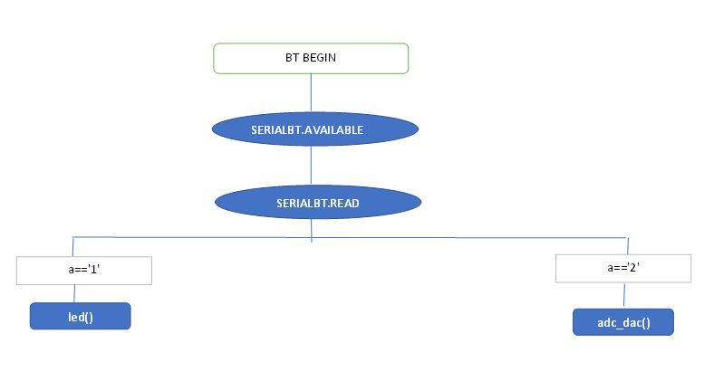

## **PRACTICA 2.1 : BLUETOOTH**  

Para hacer este proyecto hay que insertar una librería para llevar a cabo la comunicación de forma más sencilla.

Nuestra placa ESP32 tiene un modo de trabajo llamado ESP32 Serial Bluetooth. Mediante este, enviamos y recibimos información a través del puerto serie.

Para esta parte de la práctica he querido extender un poco más los conocimientos y no he querido quedarme en el mismo código que se subió en Atenea.
Lo que he hecho es a partir de esta comunicación bluetooth y después de probar que lo básico funcionaba, he diseñado un menú de opciones. Este menú es el mismo que hice la práctica anterior ya que quería centrarme en como era esta comunicación Bluetooth.

Voy a empezar explicando el void setup()

## **void setup()**
```cs

#if !defined(CONFIG_BT_ENABLED) || !defined(CONFIG_BLUEDROID_ENABLED)
#error Bluetooth is not enabled! Please run `make menuconfig` to and enable it
#endif

BluetoothSerial SerialBT;

void setup() {

  Serial.begin(9600);

  SerialBT.begin("ESP32test"); //Bluetooth device name
  Serial.println("The device started, now you can pair it with bluetooth!");

  pinMode(LED,OUTPUT);

}
```
Primero creamos un objeto de la clase BluetoothSerial llamado SerialBT. Con este objeto vamos a acceder a las funciones que tiene su clase. 
La función SerialBT.begin("###") nos permite asignar el nombre del dispositivo, es decir como nos aparecerá a la hora de querer conectarnos a él.  

## **void loop()**
```cs
void loop() {

if(SerialBT.available()) {
  char a = SerialBT.read();
  
    if(a=='1'){
      
      led();
      coments();
      a=SerialBT.read();
    }
    else if(a=='2'){
      
      adc_dac();
      coments();
      a=SerialBT.read();

    }
}


delay(20);

}
```
Lo primero que hago aquí es mirar si hay algo para enviar por parte del usuario.
Para enviar cualquier cosa usaré la aplicación Bluetooth Terminal instalada en mi móvil.
La función SerialBT.available parará el código hasta que finalmente se le envíe algo.
Declaramos una variable a como char y será la encargada de guardar la información que se le ha enviado por el puerto serie a partir de Bluetooth Terminal.
Una vez la ha recibido ya solo le queda comparar con los condicionales.
Una vez acabada la función que haya elegido. volverá a pedir que se le envíe alguna cosa.

### **Conclusiones**
En esta parte de la práctica no he tenido grandes problemas a la hora de establecer comunicación con el dispositivo.
Solo hubo una cosa que me extraño. Cuando ponía que la variable que leía los datos fuera un entero me guardaba un código bastante raro en la variable y por lo tanto no me ejecutaba el menú como era debido.
Lo solucioné poniendo cómo tipo de variable un char.



